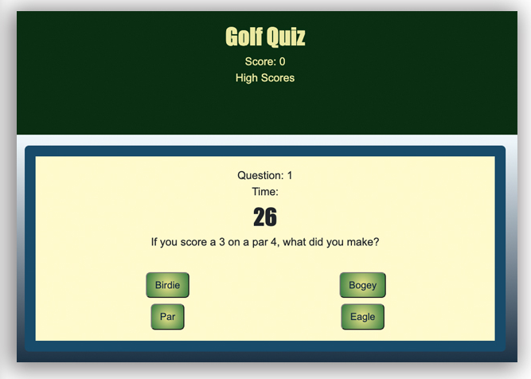

# Golf Quiz

## Description

A program that presents a timed quiz with 9 questions and 27 seconds to answer. You are presented with multiple-choice questions and given a point for every correct question. 
______

## Technologies

* Bootstrap

* HTML

* Javascript

* jQuery

* CSS

_________

## Screenshot

_________

## Link

https://bjenkins63.github.io/Jenkins-Code-Quiz/